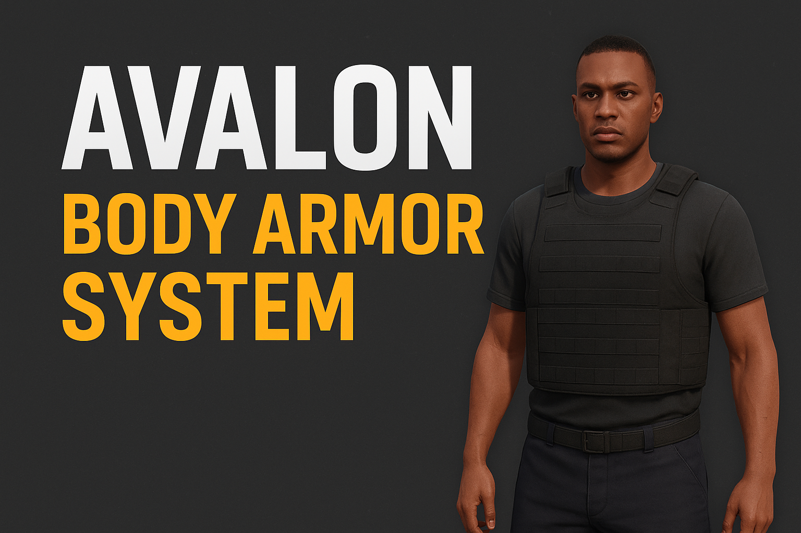

# 🦺 Avalon Bodyarmor

> **Ein leichtgewichtiges und performantes Script zur Verwendung von Schutzwesten über ox_inventory.**
> Entwickelt von **Avalon City**

---

## 🚀 Features

- Vollständig kompatibel mit **ox_inventory**
- Fortschrittsanzeige beim Anziehen der Weste (lib.progressBar)
- Dynamische Rüstung für verschiedene Westenarten
- Automatische visuelle Anpassung (männlich/weiblich)
- Einfache Erweiterung um eigene Westen

---

## ⚙️ Installation

1. **Repository klonen oder herunterladen:**
   ```bash
   git clone https://github.com/Rafiki-Andy/avalon_bodyarmor.git
   ```

2. **Ordner in dein `resources`-Verzeichnis legen.**

3. **In der `server.cfg` hinzufügen:**
   ```bash
   ensure avalon_bodyarmor
   ```

4. **Füge die Items in ox_inventory ein:**
   ```lua
   ['bodyarmor'] = {
       label = 'Schutzweste',
       weight = 1000,
       stack = false,
       close = true,
       description = 'Eine Schutzweste, die dich schützt.',
       client = { event = 'avalon_bodyarmor:useBodyArmor' }
   },
   ['pd_lightarmor'] = {
       label = 'Leichte Schutzweste (PD)',
       weight = 1000,
       stack = false,
       close = true,
       description = 'Leichte Polizeiweste.',
       client = { event = 'avalon_bodyarmor:usePdLight' }
   },
   ['pd_heavyarmor'] = {
       label = 'Schwere Schutzweste (PD)',
       weight = 1000,
       stack = false,
       close = true,
       description = 'Schwere Polizeiweste.',
       client = { event = 'avalon_bodyarmor:usePdHeavy' }
   },
   ```

---

## 🧩 Vorschau



---

## 💡 Credits

**Avalon City**  
👤 *Rafiki | Andy*  
📅 *Last Update: 2025-10-25*  
💬 [Discord Server](https://discord.gg/NvMkhqVJdM)

---

> 💬 **Lizenz:** Dieses Projekt steht unter der [MIT License](LICENSE).  
> Bitte nenne „Avalon City“ als Quelle, falls du den Code teilst oder modifizierst.
